# 楽天モバイル従業員紹介キャンペーン キーワード選定

## 概要

楽天モバイル関連の競合サイトデータを分析し、**顕在層向け（収益化記事）** と **潜在層向け（集客記事）** から30キーワードをピックアップしました。

- **データソース**: jp.rmobileouen.net / www.mobile-campaign.site
- **分析日**: 2026-02-03

---

## 厳選30キーワード

### 顕在層向け（収益化記事）- 15キーワード

契約意図が高く、CVRが高いキーワード

| No. | キーワード | 検索Vol | KD | 選定理由 |
|-----|-----------|---------|-----|---------|
| 1 | 楽天モバイル従業員紹介キャンペーン | 500 | 0 | **メインKW** KD0で確実に上位取れる |
| 2 | 楽天モバイル 従業員紹介 | 1,800 | 0 | **メインKW** KD0で狙い目 |
| 3 | 三木谷紹介 | 2,200 | 0 | **重要** 三木谷経由との比較記事 |
| 4 | 三木谷キャンペーン | 17,000 | 1 | 高ボリューム＋低KD |
| 5 | 楽天モバイル 三木谷 キャンペーン | 11,000 | 1 | 高ボリューム＋低KD |
| 6 | 楽天モバイル 家族割 | 30,000 | 0 | **最高ボリューム** KD0 |
| 7 | 楽天モバイル 乗り換え キャンペーン | 15,000 | 4 | 高ボリューム＋低KD |
| 8 | 楽天モバイル 紹介キャンペーン | 11,000 | 30 | 紹介系の代表KW |
| 9 | 楽天モバイル 新規契約 キャンペーン | 4,300 | 4 | 新規契約ユーザー獲得 |
| 10 | 楽天モバイル mnp キャンペーン | 3,600 | 3 | MNP乗り換えユーザー獲得 |
| 11 | 楽天モバイル 端末0円 | 3,300 | 2 | 端末セット契約促進 |
| 12 | 楽天モバイル iphone 1円 | 3,300 | 1 | iPhone需要を取り込む |
| 13 | 楽天モバイル 2回線目 | 2,400 | 1 | 複数回線契約促進 |
| 14 | 楽天最強プラン | 6,600 | 12 | プラン解説→契約促進 |
| 15 | 楽天モバイル 料金 | 15,000 | 28 | 料金比較→契約促進 |

### 潜在層向け（集客記事）- 15キーワード

情報収集段階のユーザーを取り込み、契約へ誘導

| No. | キーワード | 検索Vol | KD | 選定理由 |
|-----|-----------|---------|-----|---------|
| 16 | 楽天モバイル デメリット | 14,000 | 0 | **最重要** 高ボリューム＋KD0 |
| 17 | 楽天モバイル 圏外 | 1,800 | 0 | 不安解消→契約促進 |
| 18 | 楽天モバイル 危ない | 800 | 0 | 不安解消→契約促進 |
| 19 | 楽天モバイル メリット デメリット | 800 | 0 | 比較検討層を獲得 |
| 20 | 楽天モバイル ホームルーター化 | 1,900 | 0 | 活用法→契約促進 |
| 21 | 楽天モバイル 日割り | 1,600 | 0 | 契約タイミングの疑問解消 |
| 22 | 楽天モバイル 店舗 飛び込み | 1,100 | 0 | 来店→契約促進 |
| 23 | 楽天モバイル 通信障害 | 11,000 | 22 | 高ボリューム |
| 24 | 楽天モバイル 海外 | 10,000 | 29 | 海外利用需要を獲得 |
| 25 | 楽天モバイル 電波 | 8,400 | 22 | 電波の不安解消 |
| 26 | 楽天モバイル esim | 7,800 | 8 | eSIM需要を獲得 |
| 27 | 楽天モバイル 対応機種 | 7,300 | 42 | 機種確認→契約促進 |
| 28 | 楽天モバイル 繋がらない | 1,300 | 7 | 不安解消→契約促進 |
| 29 | 楽天 プラチナバンド | 1,400 | 6 | 電波改善の情報提供 |
| 30 | 楽天モバイル 来店予約 | 2,000 | 4 | 来店予約→契約促進 |

---

## 記事構成案（30キーワード対応）

### 収益化記事（10記事）

| No. | 記事タイトル案 | 対象キーワード |
|-----|---------------|---------------|
| 1 | 楽天モバイル従業員紹介キャンペーン完全ガイド | #1, #2 |
| 2 | 三木谷キャンペーンと従業員紹介の違いを徹底比較 | #3, #4, #5 |
| 3 | 楽天モバイル紹介キャンペーン完全ガイド | #8 |
| 4 | 楽天モバイル家族割で最大限お得に契約する方法 | #6 |
| 5 | 楽天モバイル乗り換えキャンペーン最新情報 | #7, #10 |
| 6 | 楽天モバイル新規契約キャンペーン完全ガイド | #9 |
| 7 | 楽天モバイル端末0円・iPhone1円キャンペーン解説 | #11, #12 |
| 8 | 楽天モバイル2回線目の契約方法とメリット | #13 |
| 9 | 楽天最強プラン徹底解説 | #14 |
| 10 | 楽天モバイル料金プラン完全ガイド | #15 |

### 集客記事（10記事）

| No. | 記事タイトル案 | 対象キーワード |
|-----|---------------|---------------|
| 11 | 楽天モバイルのデメリットは?実際に使ってわかった真実 | #16, #18, #19 |
| 12 | 楽天モバイルの電波は悪い?圏外対策と改善方法 | #17, #25, #28 |
| 13 | 楽天モバイル通信障害の対処法と最新情報 | #23 |
| 14 | 楽天モバイルの海外利用完全ガイド | #24 |
| 15 | 楽天モバイルeSIM設定・機種変更完全ガイド | #26 |
| 16 | 楽天モバイル対応機種一覧と確認方法 | #27 |
| 17 | 楽天モバイルをホームルーター化する方法 | #20 |
| 18 | 楽天モバイルプラチナバンド最新情報 | #29 |
| 19 | 楽天モバイルの日割り計算と契約タイミング | #21 |
| 20 | 楽天モバイル店舗への来店予約・飛び込み方法 | #22, #30 |

---

## キーワード分布サマリー

| 分類 | KW数 | 合計検索Vol | 平均KD |
|------|------|-------------|--------|
| 顕在層向け | 15 | 128,800 | 6.5 |
| 潜在層向け | 15 | 70,200 | 9.3 |
| **合計** | **30** | **199,000** | **7.9** |

### KD別内訳

| KD | KW数 | 備考 |
|----|------|------|
| 0（超低難易度） | 11 | 優先的に狙う |
| 1-10（低難易度） | 11 | 早期に上位表示可能 |
| 11-30（中難易度） | 6 | 中期で狙う |
| 31以上（高難易度） | 2 | 長期で狙う |

---

## サイトマップ（内部リンク構造）

```mermaid
flowchart TB
    subgraph 収益記事["収益記事（CVポイント）"]
        R1["<b>楽天モバイル従業員紹介キャンペーン</b><br/>Vol: 1,900"]
        R2["楽天モバイル キャンペーン<br/>Vol: 1,000"]
        R3["楽天 従業員紹介キャンペーン 確認方法<br/>Vol: 210"]
        R4["楽天 従業員紹介キャンペーン 三木谷<br/>Vol: 210"]
    end

    subgraph 集客_キャンペーン系["集客記事：キャンペーン系"]
        C1["三木谷キャンペーン<br/>Vol: 17,000"]
        C2["楽天モバイル 乗り換え キャンペーン<br/>Vol: 22,200"]
        C3["楽天モバイル 新規契約 キャンペーン<br/>Vol: 4,400"]
        C4["楽天モバイル キャンペーン 併用<br/>Vol: 880"]
        C5["楽天モバイル iphone キャンペーン<br/>Vol: 720"]
        C6["楽天モバイル 出戻り キャンペーン<br/>Vol: 200"]
        C7["楽天モバイル 一番お得なキャンペーン<br/>Vol: 110"]
    end

    subgraph 集客_不安解消系["集客記事：不安解消系"]
        D1["楽天モバイル 評判<br/>Vol: 14,800"]
        D2["楽天モバイル デメリット<br/>Vol: 14,000"]
        D3["楽天 電波悪い<br/>Vol: 1,400"]
        D4["楽天 繋がらない<br/>Vol: 1,100"]
        D5["楽天モバイル メリットしかない<br/>Vol: 200"]
        D6["楽天モバイル 危ない<br/>Vol: 100"]
    end

    subgraph 集客_機能活用系["集客記事：機能・活用系"]
        E1["楽天モバイル 家族割<br/>Vol: 3,000"]
        E2["楽天 機種変更<br/>Vol: 3,000"]
        E3["楽天 esim 機種変更<br/>Vol: 2,000"]
        E4["楽天 ホームルーター<br/>Vol: 1,800"]
        E5["楽天 最強プラン<br/>Vol: 1,400"]
        E6["楽天モバイル 乗り換え タイミング<br/>Vol: 1,000"]
        E7["楽天 1円スマホ<br/>Vol: 700"]
        E8["楽天モバイル 2回線目 家族<br/>Vol: 350"]
        E9["楽天モバイル 海外<br/>Vol: 200"]
    end

    subgraph 集客_従業員紹介関連["集客記事：従業員紹介関連"]
        F1["楽天モバイル 紹介ポイント 付与されない<br/>Vol: 150"]
        F2["楽天モバイル 従業員紹介キャンペーン 店舗<br/>Vol: 90"]
        F3["楽天モバイル 従業員紹介キャンペーン 2回線目<br/>Vol: 10"]
    end

    %% キャンペーン系 → 収益記事
    C1 --> R1
    C1 --> R4
    C2 --> R1
    C2 --> R2
    C3 --> R1
    C3 --> R2
    C4 --> R1
    C4 --> R2
    C5 --> R1
    C6 --> R1
    C7 --> R1
    C7 --> R2

    %% 不安解消系 → 収益記事
    D1 --> R1
    D2 --> R1
    D3 --> R1
    D4 --> R1
    D5 --> R1
    D6 --> R1

    %% 機能・活用系 → 収益記事
    E1 --> R1
    E2 --> R1
    E3 --> R1
    E4 --> R1
    E5 --> R1
    E6 --> R1
    E6 --> R2
    E7 --> R1
    E8 --> R1
    E9 --> R1

    %% 従業員紹介関連 → 収益記事
    F1 --> R1
    F1 --> R3
    F2 --> R1
    F2 --> R3
    F3 --> R1
    F3 --> R3

    %% 収益記事間のリンク
    R2 --> R1
    R3 --> R1
    R4 --> R1

    %% スタイル
    style R1 fill:#ff6b6b,stroke:#c0392b,stroke-width:3px,color:#fff
    style R2 fill:#ff8787,stroke:#c0392b,stroke-width:2px,color:#fff
    style R3 fill:#ff8787,stroke:#c0392b,stroke-width:2px,color:#fff
    style R4 fill:#ff8787,stroke:#c0392b,stroke-width:2px,color:#fff
```



---

## キーワードリスト

### 収益記事（4記事）

| No. | キーワード | 検索Vol | 役割 |
|-----|-----------|---------|------|
| 1 | 楽天モバイル従業員紹介キャンペーン | 1,900 | **メイン収益記事** |
| 2 | 楽天 モバイル キャンペーン | 1,000 | キャンペーン総合 |
| 3 | 楽天 従業員紹介キャンペーン 確認方法 | 210 | 申込後フォロー |
| 4 | 楽天 従業員紹介キャンペーン 三木谷 | 210 | 三木谷との比較 |

### 集客記事（26記事）

| No. | キーワード | 検索Vol | カテゴリ |
|-----|-----------|---------|---------|
| 5 | 楽天モバイル 乗り換え キャンペーン | 22,200 | キャンペーン系 |
| 6 | 三木谷キャンペーン | 17,000 | キャンペーン系 |
| 7 | 楽天モバイル 評判 | 14,800 | 不安解消系 |
| 8 | 楽天モバイル デメリット | 14,000 | 不安解消系 |
| 9 | 楽天モバイル 新規契約 キャンペーン | 4,400 | キャンペーン系 |
| 10 | 楽天モバイル 家族割 | 3,000 | 機能・活用系 |
| 11 | 楽天 機種変更 | 3,000 | 機能・活用系 |
| 12 | 楽天 esim 機種変更 | 2,000 | 機能・活用系 |
| 13 | 楽天 ホームルーター | 1,800 | 機能・活用系 |
| 14 | 楽天 電波悪い | 1,400 | 不安解消系 |
| 15 | 楽天 最強プラン | 1,400 | 機能・活用系 |
| 16 | 楽天 繋がらない | 1,100 | 不安解消系 |
| 17 | 楽天モバイル 乗り換え タイミング | 1,000 | 機能・活用系 |
| 18 | 楽天モバイル キャンペーン 併用 | 880 | キャンペーン系 |
| 19 | 楽天モバイル iphone キャンペーン | 720 | キャンペーン系 |
| 20 | 楽天 1円スマホ | 700 | 機能・活用系 |
| 21 | 楽天モバイル 2回線目 家族 | 350 | 機能・活用系 |
| 22 | 楽天モバイル 出戻り キャンペーン | 200 | キャンペーン系 |
| 23 | 楽天モバイル メリットしかない | 200 | 不安解消系 |
| 24 | 楽天モバイル 海外 | 200 | 機能・活用系 |
| 25 | 楽天モバイル 紹介ポイント 付与されない | 150 | 従業員紹介関連 |
| 26 | 楽天モバイル 一番お得なキャンペーン | 110 | キャンペーン系 |
| 27 | 楽天モバイル 危ない | 100 | 不安解消系 |
| 28 | 楽天モバイル 従業員紹介キャンペーン 店舗 | 90 | 従業員紹介関連 |
| 29 | 楽天モバイル 従業員紹介キャンペーン 2回線目 | 10 | 従業員紹介関連 |
| 30 | 楽天モバイル esim | - | 機能・活用系 |

---

## 内部リンク戦略

### リンク構造の考え方

```
集客記事（潜在層向け）
    ↓ 内部リンク
収益記事（顕在層向け・CVポイント）
    ↓ CTA
従業員紹介キャンペーン申込
```

### カテゴリ別リンク先

| カテゴリ | 記事数 | 主なリンク先 |
|---------|--------|-------------|
| キャンペーン系 | 7記事 | R1, R2 |
| 不安解消系 | 6記事 | R1 |
| 機能・活用系 | 9記事 | R1 |
| 従業員紹介関連 | 3記事 | R1, R3 |

### 合計検索ボリューム

| 分類 | 記事数 | 合計Vol |
|------|--------|---------|
| 収益記事 | 4 | 3,320 |
| 集客記事 | 26 | 90,920 |
| **合計** | **30** | **94,240** |
