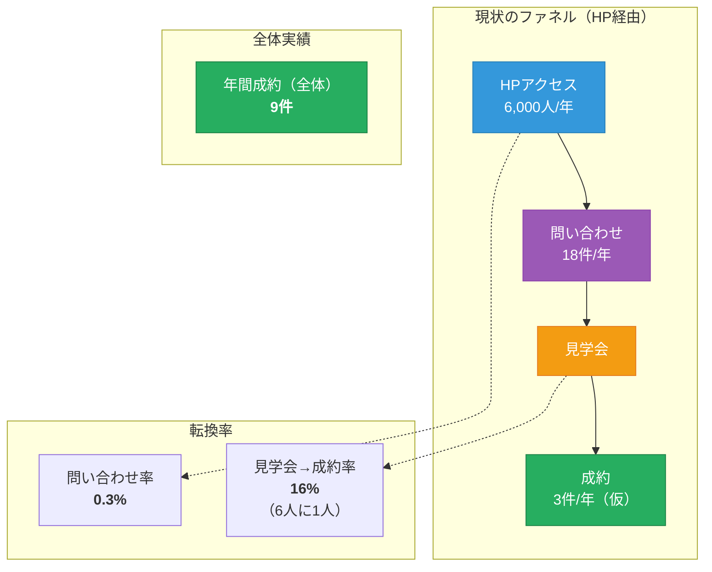
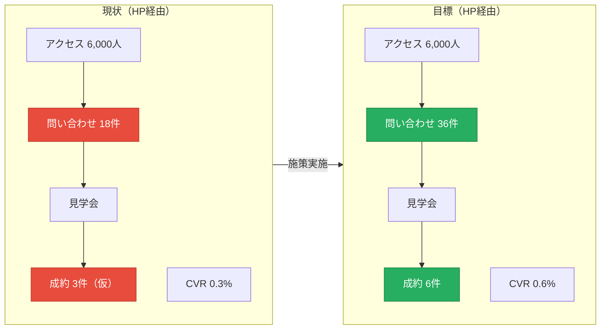
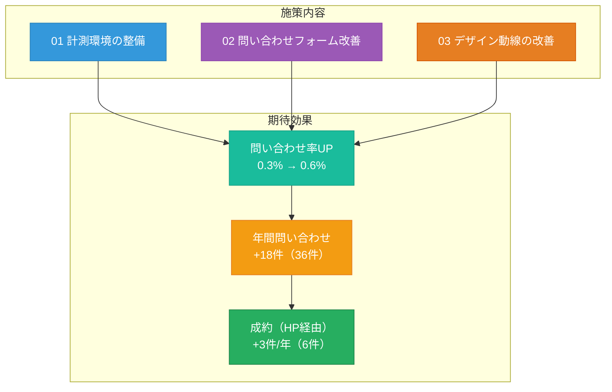
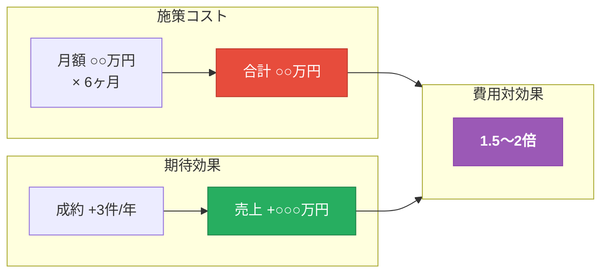
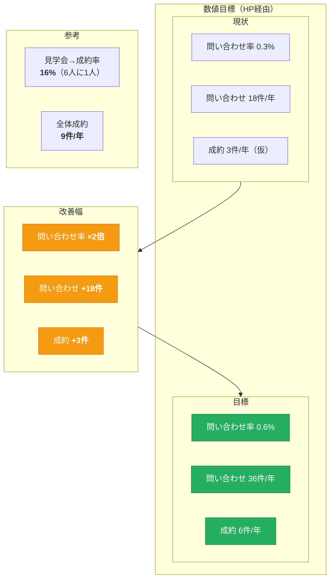
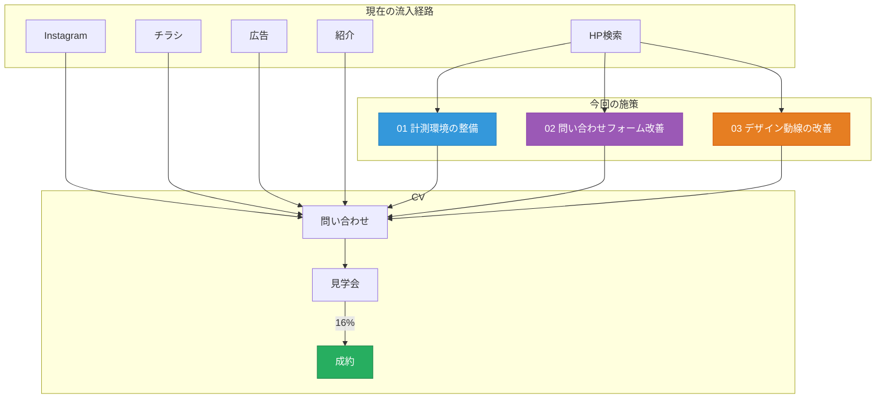
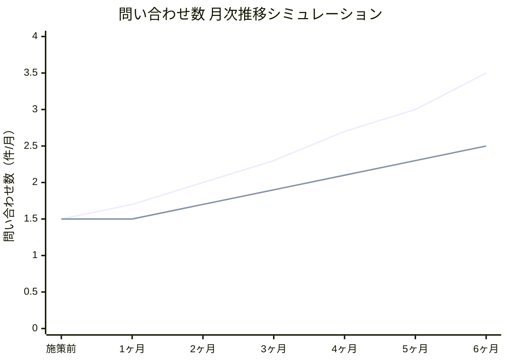
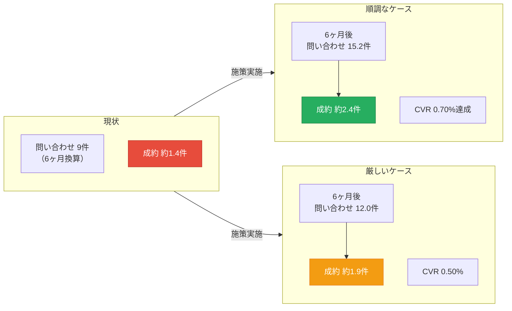

# 先元組 提案スライド 図解

## 前提数値

| 項目 | 数値 | 備考 |
|------|------|------|
| 年間HPアクセス | 6,000人 | |
| 年間問い合わせ数（HP経由） | 18件 | |
| 問い合わせ率（CVR） | 0.3% | 18÷6,000 |
| 見学会→成約率 | 16% | 6人に1人が成約 |
| **年間成約数（全体）** | **9件** | 全チャネル合計 |
| 年間成約数（HP経由） | 3件（仮） | 18件×16%から推計 |

---

## スライド1: 現状のファネル分析



---

## スライド2: ビフォーアフター比較



---

## スライド2: 施策による改善イメージ



---

## スライド3: 費用対効果



---

## 数値サマリー図



---

## 流入経路と施策の関係



---

## シミュレーションスライド

### 前提条件

| 項目 | 現状 | 目標 |
|------|------|------|
| 月間問い合わせ数 | 1.5件 | 3件 |
| 年間問い合わせ数 | 18件 | 36件 |
| 問い合わせ率（CVR） | 0.3% | 0.6% |
| 施策期間 | - | 6ヶ月 |

---

### シミュレーション：問い合わせ数の推移



---

### シミュレーション詳細（数値表）

#### 順調なケース

| 月 | 問い合わせ数 | CVR | 累計問い合わせ | 成約見込み（16%） |
|----|-------------|-----|---------------|------------------|
| 施策前 | 1.5件/月 | 0.30% | - | - |
| 1ヶ月目 | 1.7件 | 0.34% | 1.7件 | 0.3件 |
| 2ヶ月目 | 2.0件 | 0.40% | 3.7件 | 0.6件 |
| 3ヶ月目 | 2.3件 | 0.46% | 6.0件 | 1.0件 |
| 4ヶ月目 | 2.7件 | 0.54% | 8.7件 | 1.4件 |
| 5ヶ月目 | 3.0件 | 0.60% | 11.7件 | 1.9件 |
| 6ヶ月目 | 3.5件 | 0.70% | 15.2件 | 2.4件 |
| **6ヶ月合計** | - | - | **15.2件** | **約2.4件** |

#### 厳しいケース

| 月 | 問い合わせ数 | CVR | 累計問い合わせ | 成約見込み（16%） |
|----|-------------|-----|---------------|------------------|
| 施策前 | 1.5件/月 | 0.30% | - | - |
| 1ヶ月目 | 1.5件 | 0.30% | 1.5件 | 0.2件 |
| 2ヶ月目 | 1.7件 | 0.34% | 3.2件 | 0.5件 |
| 3ヶ月目 | 1.9件 | 0.38% | 5.1件 | 0.8件 |
| 4ヶ月目 | 2.1件 | 0.42% | 7.2件 | 1.2件 |
| 5ヶ月目 | 2.3件 | 0.46% | 9.5件 | 1.5件 |
| 6ヶ月目 | 2.5件 | 0.50% | 12.0件 | 1.9件 |
| **6ヶ月合計** | - | - | **12.0件** | **約1.9件** |

---

### シミュレーション比較図



---

### シミュレーションまとめ

| ケース | 6ヶ月後CVR | 問い合わせ増加 | 成約増加 | 現状比 |
|--------|-----------|---------------|---------|--------|
| **順調** | 0.70% | +6.2件 | +1.0件 | **+69%** |
| **厳しい** | 0.50% | +3.0件 | +0.5件 | **+33%** |

**ポイント**:
- 厳しいケースでも現状より**+33%**の改善見込み
- 順調なケースでは6ヶ月で**CVR 0.70%**達成の可能性
- 見学会→成約率16%は固定として計算

---

---

## シミュレーション（スプレッドシート形式）

### 順調なケース

| 指標 | 現状 | 1ヶ月 | 2ヶ月 | 3ヶ月 | 4ヶ月 | 5ヶ月 | 6ヶ月 | 合計 |
|------|------|-------|-------|-------|-------|-------|-------|------|
| HPアクセス数（月間） | 500 | 500 | 500 | 500 | 500 | 500 | 500 | 3,000 |
| 問い合わせ率（CVR） | 0.30% | 0.32% | 0.36% | 0.40% | 0.46% | 0.52% | 0.58% | - |
| 問い合わせ数 | 1.5 | 1.6 | 1.8 | 2.0 | 2.3 | 2.6 | 2.9 | 13.2 |
| 見学会来場数 | 1.5 | 1.6 | 1.8 | 2.0 | 2.3 | 2.6 | 2.9 | 13.2 |
| 成約率 | 16% | 16% | 16% | 16% | 16% | 16% | 16% | - |
| **成約数（CV）** | - | 0.26 | 0.29 | 0.32 | 0.37 | 0.42 | 0.46 | **2.1** |

#### 費用対効果

| 項目 | 金額 |
|------|------|
| **費用対効果（a-b）** | **○○万円** |
| a: 想定売上（利益） | ○○万円 |
| b: 想定費用 | ○○万円 |
| 想定CV人数（6ヶ月累計） | 2.1件 |
| 現状CV人数（6ヶ月換算） | 1.1件 |
| **施策による成約増分** | **+1.0件** |
| **想定ROAS** | **○○%** |

※6人見学会で1人成約想定（成約率16%）
※現状：月1.5件問い合わせ × 6ヶ月 × 16% = 1.1件成約

---

### 厳しいケース

| 指標 | 現状 | 1ヶ月 | 2ヶ月 | 3ヶ月 | 4ヶ月 | 5ヶ月 | 6ヶ月 | 合計 |
|------|------|-------|-------|-------|-------|-------|-------|------|
| HPアクセス数（月間） | 500 | 500 | 500 | 500 | 500 | 500 | 500 | 3,000 |
| 問い合わせ率（CVR） | 0.30% | 0.30% | 0.32% | 0.34% | 0.36% | 0.38% | 0.40% | - |
| 問い合わせ数 | 1.5 | 1.5 | 1.6 | 1.7 | 1.8 | 1.9 | 2.0 | 10.5 |
| 見学会来場数 | 1.5 | 1.5 | 1.6 | 1.7 | 1.8 | 1.9 | 2.0 | 10.5 |
| 成約率 | 16% | 16% | 16% | 16% | 16% | 16% | 16% | - |
| **成約数（CV）** | - | 0.24 | 0.26 | 0.27 | 0.29 | 0.30 | 0.32 | **1.7** |

#### 費用対効果

| 項目 | 金額 |
|------|------|
| **費用対効果（a-b）** | **○○万円** |
| a: 想定売上（利益） | ○○万円 |
| b: 想定費用 | ○○万円 |
| 想定CV人数（6ヶ月累計） | 1.7件 |
| 現状CV人数（6ヶ月換算） | 1.1件 |
| **施策による成約増分** | **+0.6件** |
| **想定ROAS** | **○○%** |

※6人見学会で1人成約想定（成約率16%）
※現状：月1.5件問い合わせ × 6ヶ月 × 16% = 1.1件成約

---

### ROAS計算用メモ（要確認事項）

費用対効果を計算するために、以下の数値を先方に確認：

| 確認項目 | 仮数値 | 備考 |
|---------|--------|------|
| 注文住宅1件あたりの売上 | 3,500万円？ | 平均単価 |
| 粗利率 | 10%？ | 売上に対する利益率 |
| 1件あたりの利益 | 350万円？ | 売上×粗利率 |
| 施策費用（月額） | ○○万円 | 要設定 |
| 施策費用（6ヶ月合計） | ○○万円 | 月額×6 |

#### ROAS計算例（順調なケースの場合）

```
想定成約数: 2.1件（6ヶ月累計）
現状成約数: 1.1件（6ヶ月換算）
増加分: +1.0件

想定売上増加: 1.0件 × 3,500万円 = 3,500万円
想定利益増加: 3,500万円 × 10% = 350万円

ROAS = 想定利益 ÷ 施策費用 × 100
```

---

## スライド構成まとめ

| スライド | 内容 | 担当 | 使用図解 |
|---------|------|------|---------|
| 1 | 現状分析と課題 | 入江 | ファネル図 |
| 2 | 施策内容とシミュレーション | 入江 | ビフォーアフター図 |
| 3 | Instagramシミュレーション | 山元 | - |
| 4 | 費用対効果・まとめ | 山元 | ROI図 |
