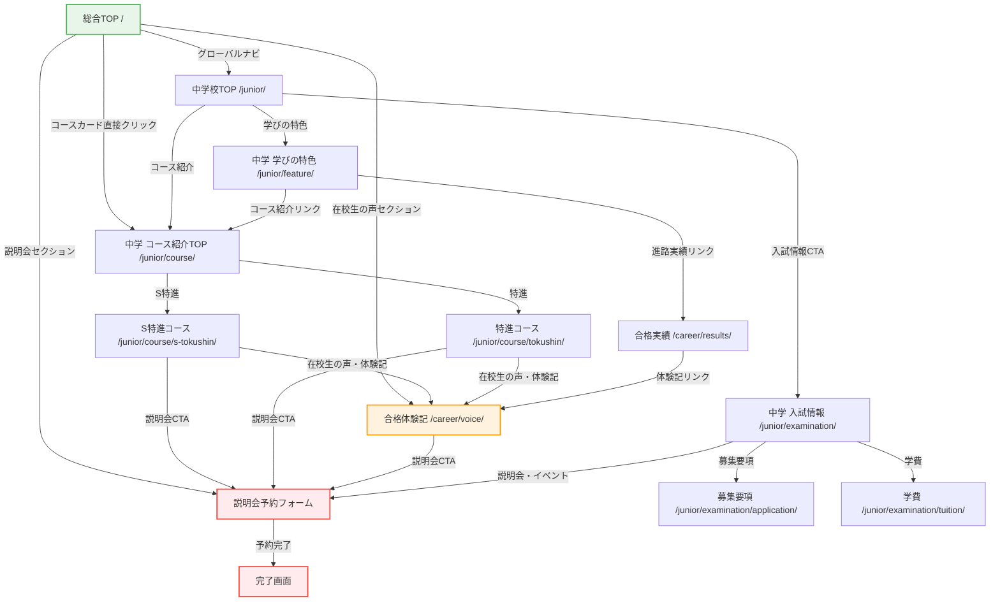
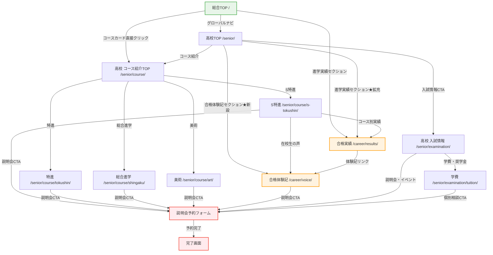
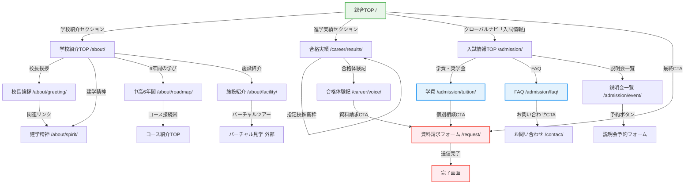
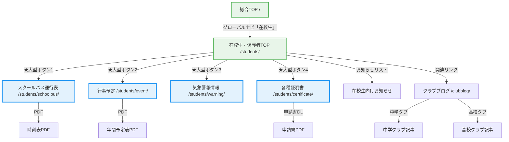
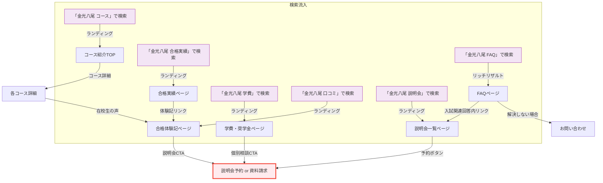

# 金光八尾中学校・高等学校 改善版サイトマップ＆テンプレート構成案

## 現状の課題

### 導線の深さ（現状）

| ページ | 現状クリック数 | 問題 |
|--------|:---:|------|
| コース詳細（S特進等） | 3 | 受験生が最も知りたい情報なのに深い |
| クラブ活動ブログ | 3 | 学校生活のイメージが掴みにくい |
| 合格体験記 | 2 | 受験生の意思決定に直結するのに埋もれている |
| 年間行事・一日の流れ | 3 | 保護者が気にするが到達しにくい |
| 学費情報 | 3 | 保護者が必ず確認するのに深い |

### 構造的な課題
1. **合格体験記が「進路情報」の下層に埋もれている** → 受験生の背中を押すコンテンツなのに到達しにくい
2. **中学・高校のコンテンツが完全分離** → クラブブログ、イベント情報が中高別々で回遊しにくい
3. **コース詳細が3クリック必要** → TOPから直接到達させるべき
4. **学費情報が入試情報の下層** → 保護者が比較検討で必ず見るのにアクセスが悪い

---

## 改善版サイトマップ

### 設計方針
- **受験生・保護者が最も見たい情報を2クリック以内で到達可能にする**
- **合格体験記・在校生の声をサイト全体で前面に出す**
- **中高一貫校としての6年間の流れを見せる**

---

### グローバルナビゲーション（改善案）

```
┌──────────────────────────────────────────────────────────────────┐
│ [ロゴ]   中学校 | 高等学校 | 学校紹介 | 進路・実績 | 入試情報    │
│                        [在校生] [卒業生] [資料請求] [説明会予約] │
└──────────────────────────────────────────────────────────────────┘
```

**変更ポイント：**
- 「進路・実績」を独立メニューに（合格体験記を含む）
- 「入試情報」を独立メニューに（学費も含む）
- 「資料請求」「説明会予約」を常時CTAボタンとして表示
- 「学校概要」→「学校紹介」に名称変更（親しみやすく）

---

### 全体サイトマップ

```
金光八尾中学校・高等学校
│
├─ 総合TOP (/）
│
├─ 中学校 (/junior/)
│  ├─ 学びの特色 (/junior/feature/)
│  ├─ コース紹介 (/junior/course/)
│  │  ├─ S特進コース (/junior/course/s-tokushin/)
│  │  └─ 特進コース (/junior/course/tokushin/)
│  ├─ 学校生活 (/junior/schoollife/)
│  │  ├─ 金光八尾の一日 (/junior/schoollife/daily/)
│  │  ├─ 年間行事 (/junior/schoollife/events/)
│  │  └─ クラブ活動 (/junior/schoollife/club/)
│  └─ 入試情報 (/junior/examination/)
│     ├─ 説明会・イベント (/junior/examination/event/)
│     ├─ 募集要項 (/junior/examination/application/)
│     └─ 学費・諸経費 (/junior/examination/tuition/)
│
├─ 高等学校 (/senior/)
│  ├─ 学びの特色 (/senior/feature/)
│  ├─ コース紹介 (/senior/course/)
│  │  ├─ S特進コース (/senior/course/s-tokushin/)
│  │  ├─ 特進コース (/senior/course/tokushin/)
│  │  ├─ 総合進学コース (/senior/course/shingaku/)
│  │  └─ 美術コース (/senior/course/art/)
│  ├─ 学校生活 (/senior/schoollife/)
│  │  ├─ 金光八尾の一日 (/senior/schoollife/daily/)
│  │  ├─ 年間行事 (/senior/schoollife/events/)
│  │  └─ クラブ活動 (/senior/schoollife/club/)
│  └─ 入試情報 (/senior/examination/)
│     ├─ 説明会・イベント (/senior/examination/event/)
│     ├─ 募集要項 (/senior/examination/application/)
│     └─ 学費・諸経費 (/senior/examination/tuition/)
│
├─ 学校紹介 (/about/)  ※旧 /overview/
│  ├─ 学校長挨拶 (/about/greeting/)
│  ├─ 建学精神・教育方針 (/about/spirit/)
│  ├─ 中高6年間の学び (/about/roadmap/)  ★新規
│  ├─ あゆみ・沿革 (/about/history/)
│  ├─ 制服について (/about/uniform/)
│  ├─ 教育環境・施設 (/about/facility/)
│  ├─ デジタルパンフレット (/about/pamphlet/)
│  └─ アートギャラリー (/about/gallery/)
│
├─ 進路・実績 (/career/)  ★構成変更
│  ├─ 合格実績 (/career/results/)
│  ├─ 合格体験記 (/career/voice/)  ★前面に配置
│  ├─ 在校生の声 (/career/students/)  ★新規
│  └─ 卒業生メッセージ (/career/alumni/)  ★新規
│
├─ 入試情報（統合版） (/admission/)  ★新規
│  ├─ 中学校入試 (/admission/junior/)
│  ├─ 高校入試 (/admission/senior/)
│  ├─ 説明会・イベント一覧 (/admission/event/)  ★統合
│  ├─ 学費・奨学金 (/admission/tuition/)  ★前面化
│  └─ よくある質問 (/admission/faq/)  ★移動
│
├─ クラブ活動ブログ (/clubblog/)  ★統合
│  ├─ 中学校 (/clubblog/?school=junior)  タブ切替
│  └─ 高等学校 (/clubblog/?school=senior)  タブ切替
│
├─ お知らせ (/news/)
├─ トピックス (/topics/)
│
├─ 在校生・保護者 (/students/)
│  ├─ 行事予定 (/students/event/)
│  ├─ スクールバス (/students/schoolbus/)
│  ├─ 気象警報 (/students/warning/)
│  └─ 各種証明書 (/students/certificate/)
│
├─ 卒業生 (/graduates/)
│  └─ 各種証明書 (/graduates/certificate/)
│
├─ 共通ページ
│  ├─ 資料請求 (/request/)
│  ├─ お問い合わせ (/contact/)
│  ├─ アクセス (/access/)
│  ├─ 学校評価・財務情報 (/evaluation/)
│  ├─ いじめ防止方針 (PDF)
│  ├─ 採用情報 (/recruit/)
│  ├─ 個人情報保護 (/privacy/)
│  ├─ サイトポリシー (/sitepolicy/)
│  └─ スクールポリシー (/schoolpolicy/)
│
└─ 外部リンク
   ├─ バーチャル学校見学 (外部)
   ├─ 関西福祉大学 (外部)
   ├─ 金光大阪中高 (外部)
   └─ 関西金光学園100周年 (外部)
```

---

## 改善による到達クリック数の変化

| ページ | 現状 | 改善後 | 改善方法 |
|--------|:---:|:---:|------|
| 合格体験記 | 2 | **1** | グローバルナビ「進路・実績」から直接到達 |
| コース詳細 | 3 | **2** | TOPにコース一覧を配置、直接リンク |
| クラブ活動ブログ | 3 | **1** | グローバルナビに独立項目として追加 |
| 学費情報 | 3 | **2** | 「入試情報」メニューから直接到達 |
| 在校生の声 | ∞（存在しない） | **1** | 新規作成、グローバルナビから到達 |
| 説明会・イベント（統合） | 1 | **1** | 維持（中高統合版を新設） |
| FAQ | 1 | **1** | 維持（入試情報セクションにも配置） |

---

## トップページの改善構成

### 現状の問題
- 中学校・高校のリンクが中心で「受験生が知りたい情報」への導線が弱い
- 合格体験記・在校生の声がTOPに一切表示されていない

### 改善版トップページの構成

```
┌──────────────────────────────────────────────────────────┐
│                                                          │
│  ① ファーストビュー（FV）                                │
│     メインビジュアル（スライダー）                        │
│     ・学校の魅力を伝える写真                             │
│     ・「説明会予約」「資料請求」CTAボタン                 │
│     ・重要なお知らせバナー                                │
│                                                          │
├──────────────────────────────────────────────────────────┤
│                                                          │
│  ② 選ばれる3つの理由（新規）                             │
│     ・6年一貫教育 / 進学実績 / 少人数制                  │
│     ・各理由にCTAリンク                                  │
│                                                          │
├──────────────────────────────────────────────────────────┤
│                                                          │
│  ③ コース紹介セクション（★改善: 1クリック化）            │
│     ┌─────┐ ┌─────┐ ┌─────┐ ┌─────┐ ┌─────┐ ┌─────┐  │
│     │中学  │ │中学  │ │高校  │ │高校  │ │高校  │ │高校  │  │
│     │S特進 │ │特進  │ │S特進 │ │特進  │ │総合  │ │美術  │  │
│     │      │ │      │ │      │ │      │ │進学  │ │      │  │
│     └─────┘ └─────┘ └─────┘ └─────┘ └─────┘ └─────┘  │
│     ※TOPから各コース詳細に直接遷移（2クリック→1へ）     │
│                                                          │
├──────────────────────────────────────────────────────────┤
│                                                          │
│  ④ 在校生の声・合格体験記セクション（★新規: 最重要改善） │
│     ┌──────────────┐  ┌──────────────┐  ┌──────────────┐ │
│     │ 📸 写真       │  │ 📸 写真       │  │ 📸 写真       │ │
│     │              │  │              │  │              │ │
│     │「S特進に入って│  │「先生との距離 │  │「クラブと勉強 │ │
│     │ 夢が見つかり │  │ が近くて質問 │  │ の両立ができ │ │
│     │ ました」     │  │ しやすい」   │  │ る環境」     │ │
│     │              │  │              │  │              │ │
│     │ 中3 Aさん    │  │ 高2 Bさん    │  │ 高3 Cさん    │ │
│     └──────────────┘  └──────────────┘  └──────────────┘ │
│                                                          │
│     [もっと見る → 合格体験記]  [在校生の声を見る]         │
│                                                          │
├──────────────────────────────────────────────────────────┤
│                                                          │
│  ⑤ 進学実績セクション                                    │
│     国公立◯名 / 関関同立◯名 / 医歯薬系◯名             │
│     [詳しい合格実績を見る]                                │
│                                                          │
├──────────────────────────────────────────────────────────┤
│                                                          │
│  ⑥ 説明会・イベント情報セクション                        │
│     直近のイベント3件をカード表示                         │
│     [すべてのイベントを見る]  [説明会を予約する]          │
│                                                          │
├──────────────────────────────────────────────────────────┤
│                                                          │
│  ⑦ お知らせ＆トピックス                                  │
│     タブ切替（お知らせ / トピックス）                     │
│     直近5件をリスト表示                                  │
│                                                          │
├──────────────────────────────────────────────────────────┤
│                                                          │
│  ⑧ 学校紹介セクション                                    │
│     施設写真ギャラリー / バーチャルツアーリンク            │
│     [学校紹介を見る]  [バーチャル見学する]                │
│                                                          │
├──────────────────────────────────────────────────────────┤
│                                                          │
│  ⑨ アクセスセクション                                    │
│     地図 + 最寄り駅からの時間                             │
│     [詳しいアクセスを見る]                                │
│                                                          │
├──────────────────────────────────────────────────────────┤
│                                                          │
│  ⑩ 最終CTA                                               │
│     「金光八尾の学びを体験してみませんか？」              │
│     [資料請求]  [説明会予約]  [お問い合わせ]              │
│                                                          │
├──────────────────────────────────────────────────────────┤
│  フッター                                                │
│  サイトマップ / 法人情報 / SNS / 関連校リンク             │
└──────────────────────────────────────────────────────────┘
```

**最大の変更点：**
- ④に「在校生の声・合格体験記」を新設 → **TOPから1クリックで到達**
- ③にコース直接リンク → **TOPから1クリックでコース詳細へ**
- ⑥に説明会を統合表示 → **中学・高校の説明会を一覧化**

---

## 全ページ構成一覧（テンプレート別）

---

## ■ テンプレート1: トップページ型

---

### ページ01: 総合TOP（/）

**テンプレート:** 1-A（総合TOP専用）

| # | セクション | 内容詳細 | コンポーネント |
|:---:|------|------|------|
| 1 | ファーストビュー | メインビジュアル（スライダー3-4枚）。学校生活・行事・施設の写真。「説明会予約」「資料請求」CTAボタンを配置。重要なお知らせバー（入試日程等） | スライダー + CTAボタン + お知らせティッカー |
| 2 | ピックアップ枠 | FV直下にサムネイル付きピックアップ記事を4件表示。CMSから管理者が選択した記事を表示 | サムネイル4枚横並び（PC）/ 2×2グリッド（SP） |
| 3 | お知らせ＆トピックス | タブ切替（お知らせ / トピックス）。直近5件をリスト表示。各記事にカテゴリバッジ（中学/高校/共通） | タブ切替リスト + 「一覧を見る」リンク |
| 4 | 中学校・高等学校への誘導 | 大きめバナー2枚並び。中学校サイトへ / 高等学校サイトへ。各バナーに代表的な写真＋キャッチコピー | 2カラムバナー（クリック領域を大きく確保） |
| 5 | コース紹介 | 中学2コース＋高校4コース＝6枚のカードを横並び。各カードにコース名＋一言説明＋詳細リンク。TOPから1クリックでコース詳細へ遷移可能 | 6カラムカードグリッド（PC）/ 2×3（SP） |
| 6 | 在校生の声・合格体験記 | 全コースから抜粋した3件をスライダー表示。写真＋コメント＋属性（学年・コース）。「もっと見る → 合格体験記」「在校生の声を見る」リンク | スライダー型カード |
| 7 | 進学実績 | 国公立◯名 / 関関同立◯名 / 医歯薬系◯名。数字を大きく表示。「詳しい合格実績を見る」リンク | カウンターアニメーション＋数字強調 |
| 8 | 説明会・イベント情報 | 直近のイベント3件をカード表示。日時・イベント名・申込ステータス。「すべてのイベントを見る」「説明会を予約する」リンク | カード3枚＋CTAリンク |
| 9 | 学校紹介 | 校長挨拶へのリンク、建学精神へのリンクを明確に配置。施設写真3-4枚＋バーチャルツアーバナー。「学校紹介を見る」「校長挨拶を読む」リンク | 画像ギャラリー＋テキストリンク |
| 10 | アクセス | 地図埋込＋最寄り駅からの所要時間。「詳しいアクセスを見る」リンク | 地図＋テキスト |
| 11 | 最終CTA | 「金光八尾の学びを体験してみませんか？」。3ボタン：資料請求 / 説明会予約 / お問い合わせ | 背景色付きCTAエリア |
| 12 | フッター | サイトマップ / 法人情報 / SNS / 関連校リンク | 共通フッター |

---

### ページ02: 中学校TOP（/junior/）

**テンプレート:** 1-B（中学校TOP）
**※現状大きな問題なし。微調整のみ。**

| # | セクション | 内容詳細 | コンポーネント |
|:---:|------|------|------|
| 1 | ファーストビュー | 中学校メインビジュアル。キャッチコピー（例:「自ら学ぶ力を育てる」）。「説明会予約」CTAボタン | ヒーロー画像 + キャッチコピー + CTA |
| 2 | 学びの特色ダイジェスト | 中学校の学びの特色を2-3ブロックで紹介。テキスト＋画像の左右交互配置。「詳しく見る」リンク | テキスト＋画像交互配置 |
| 3 | コース紹介 | S特進コース / 特進コースの2枚カード。各カードに特色＋キャッチコピー＋「詳細を見る」リンク | 2カラムカードグリッド |
| 4 | 在校生の声（抜粋） | 中学生の声を2-3件表示。写真＋コメント＋学年。「もっと見る」リンク | カード型（横スクロール可） |
| 5 | 学校生活ダイジェスト | 写真グリッド（年間行事・クラブ活動・日常の様子）。「学校生活を見る」「クラブブログを見る」リンク | 写真グリッド＋リンク |
| 6 | 入試情報CTA | 中学校入試に特化したCTAバナー。説明会日程 / 募集要項 / 学費・諸経費の3リンク | バナー型3カラム |

---

### ページ03: 高等学校TOP（/senior/）

**テンプレート:** 1-C（高等学校TOP）
**★構成を大幅変更：進学実績・合格体験記を強化**

| # | セクション | 内容詳細 | コンポーネント |
|:---:|------|------|------|
| 1 | ファーストビュー | 高校メインビジュアル。キャッチコピー（例:「未来を切り拓く4つの道」）。「説明会予約」CTAボタン | ヒーロー画像 + キャッチコピー + CTA |
| 2 | 学びの特色ダイジェスト | 高校の学びの特色を2-3ブロックで紹介。テキスト＋画像の左右交互配置 | テキスト＋画像交互配置 |
| 3 | コース紹介 | S特進 / 特進 / 総合進学 / 美術の4枚カード。各カードに特色＋目標大学レベル＋リンク | 4カラムカードグリッド（PC）/ 2×2（SP） |
| 4 | ★進学実績セクション（大幅拡充） | 国公立◯名 / 関関同立◯名 / 医歯薬系◯名の数字表示。過去3年間の推移（伸びが分かるように）。指定校推薦枠80大学の紹介。「合格実績の詳細を見る」リンク | 数字ハイライト＋推移グラフ＋テキスト |
| 5 | ★合格体験記・在校生の声（新設） | 高校生の声3件をカード表示。コース名・進学先を明記。Q&A形式のダイジェスト。「すべての合格体験記を見る」「在校生の声を見る」リンク | カード型スライダー |
| 6 | 学校生活ダイジェスト | 写真グリッド（行事・部活・日常）。「学校生活を見る」「クラブブログ」リンク | 写真グリッド＋リンク |
| 7 | 入試情報CTA | 高校入試に特化したCTAバナー。説明会日程 / 募集要項 / 学費・諸経費の3リンク | バナー型3カラム |

---

## ■ テンプレート2: セクションハブ型

---

### ページ04: 中学校コース紹介TOP（/junior/course/）

| # | セクション | 内容詳細 |
|:---:|------|------|
| 1 | ヒーロー | 「中学校コース紹介」タイトル + 学習風景の画像 |
| 2 | リード文 | 「金光八尾中学校では2つのコースを用意。一人ひとりの目標に合わせた学びを提供します」 |
| 3 | コースカード | S特進コース / 特進コースの2枚。画像＋特色説明＋目標＋「詳細を見る」 |
| 4 | 学びのロードマップ | 中学→高校のコース接続図（中学S特進→高校S特進等） |
| 5 | CTA | 「説明会で詳しく聞く」「資料請求」 |

---

### ページ05: 高校コース紹介TOP（/senior/course/）

| # | セクション | 内容詳細 |
|:---:|------|------|
| 1 | ヒーロー | 「高等学校コース紹介」タイトル + 学習風景 |
| 2 | リード文 | 「4つのコースから、あなたの未来を選ぶ」 |
| 3 | コースカード | S特進 / 特進 / 総合進学 / 美術の4枚カード。画像＋特色＋目標大学レベル＋リンク |
| 4 | コース比較表 | 4コースの学習時間数・受験科目・主な進学先を一覧比較 |
| 5 | CTA | 「説明会で詳しく聞く」「資料請求」 |

---

### ページ06: 中学校学校生活（/junior/schoollife/）

| # | セクション | 内容詳細 |
|:---:|------|------|
| 1 | ヒーロー | 「中学校の学校生活」+ 学校生活写真 |
| 2 | リード文 | 学校生活の概要 |
| 3 | サブページカード | 金光八尾の一日 / 年間行事 / クラブ活動の3枚。写真＋説明＋リンク |
| 4 | 写真ギャラリー | 日常風景の写真4-6枚 |
| 5 | CTA | 「クラブブログを見る」「バーチャル見学」 |

---

### ページ07: 高校学校生活（/senior/schoollife/）

| # | セクション | 内容詳細 |
|:---:|------|------|
| 1 | ヒーロー | 「高等学校の学校生活」+ 学校生活写真 |
| 2 | リード文 | 学校生活の概要 |
| 3 | サブページカード | 金光八尾の一日 / 年間行事 / クラブ活動の3枚 |
| 4 | 写真ギャラリー | 日常風景の写真4-6枚 |
| 5 | CTA | 「クラブブログを見る」「バーチャル見学」 |

---

### ページ08: 中学校入試情報（/junior/examination/）

| # | セクション | 内容詳細 |
|:---:|------|------|
| 1 | ヒーロー | 「中学校入試情報」+ 校舎画像 |
| 2 | 重要なお知らせ | 入試に関する最新情報（バッジ付き） |
| 3 | サブページカード | 説明会・イベント / 募集要項 / 学費・諸経費の3枚。各カードに日程バッジ |
| 4 | 在校生の声（抜粋） | 「私が金光八尾を選んだ理由」2件 |
| 5 | CTA | 「説明会を予約する」「資料請求」「個別相談」 |

---

### ページ09: 高校入試情報（/senior/examination/）

| # | セクション | 内容詳細 |
|:---:|------|------|
| 1 | ヒーロー | 「高等学校入試情報」+ 校舎画像 |
| 2 | 重要なお知らせ | 入試に関する最新情報 |
| 3 | サブページカード | 説明会・イベント / 募集要項 / 学費・諸経費の3枚 |
| 4 | 在校生の声（抜粋） | 「私が金光八尾を選んだ理由」2件 |
| 5 | CTA | 「説明会を予約する」「資料請求」「個別相談」 |

---

### ページ10: 学校紹介TOP（/about/）

| # | セクション | 内容詳細 |
|:---:|------|------|
| 1 | ヒーロー | 「金光八尾を知る」+ 校舎全景画像 |
| 2 | リード文 | 学校の概要紹介 |
| 3 | サブページカード（2行構成） | 1行目: 校長挨拶 / 建学精神 / 中高6年間の学び。2行目: 沿革 / 制服 / 施設 / パンフレット / ギャラリー |
| 4 | バーチャルツアーCTA | 「オンラインで学校を見学する」バナー |
| 5 | CTA | 「資料請求」「説明会予約」 |

---

### ページ11: 進路・実績TOP（/career/）

| # | セクション | 内容詳細 |
|:---:|------|------|
| 1 | ヒーロー | 「進路・実績」+ 卒業式or大学キャンパス画像 |
| 2 | 合格実績ハイライト | 国公立◯名 / 関関同立◯名 の数字表示 |
| 3 | サブページカード | 合格実績詳細 / 合格体験記 / 在校生の声 / 卒業生メッセージの4枚 |
| 4 | 合格体験記プレビュー | 最新2件をカード表示（写真＋コメント＋進学先） |
| 5 | CTA | 「説明会で進路指導を体験」「資料請求」 |

---

### ページ12: 入試情報（統合版）TOP（/admission/）

| # | セクション | 内容詳細 |
|:---:|------|------|
| 1 | ヒーロー | 「入試情報」+ 受験風景画像 |
| 2 | 重要なお知らせ | 入試に関する最新情報 |
| 3 | サブページカード | 中学校入試 / 高校入試 / 説明会・イベント / 学費・奨学金 / FAQの5枚 |
| 4 | 直近イベント | 次回の説明会情報＋「予約する」ボタン |
| 5 | CTA | 「資料請求」「個別相談」 |

---

### ページ13: 在校生・保護者TOP（/students/）

**★改善: よく使うメニューを最上部に大きく配置**

| # | セクション | 内容詳細 |
|:---:|------|------|
| 1 | ページタイトル | 「在校生・保護者の方へ」 |
| 2 | ★よく使うメニュー（最上部に大きく配置） | 4つの大きなアイコン付きボタン: スクールバス運行表 / 行事予定 / 気象警報情報 / 各種証明書。各ボタンは44px以上のタップ領域を確保。**1クリックで各コンテンツに直接到達** |
| 3 | お知らせ（在校生向け） | 在校生・保護者向けのお知らせリスト（直近5件） |
| 4 | ダウンロード書類一覧 | よく使う書類へのリンクリスト（PDFダウンロード） |
| 5 | 関連リンク | 学校生活ページ / クラブブログへのリンク |

---

### ページ14: 卒業生TOP（/graduates/）

| # | セクション | 内容詳細 |
|:---:|------|------|
| 1 | ページタイトル | 「卒業生の方へ」 |
| 2 | よく使うメニュー | 各種証明書発行 / 同窓会情報 / 採用情報 |
| 3 | お知らせ | 卒業生向けお知らせ |
| 4 | 関連リンク | 卒業生メッセージページへのリンク |

---

## ■ テンプレート3: 詳細コンテンツ型

---

### ページ15: 中学校 学びの特色（/junior/feature/）

| # | セクション | 内容詳細 |
|:---:|------|------|
| 1 | ヒーロー | 「中学校の学びの特色」+ 授業風景画像 |
| 2 | リード文 | 中学校教育の基本理念を説明 |
| 3 | 特色① | 見出し＋テキスト＋画像（左配置）。例:「自学自習の力を育てる」 |
| 4 | 特色② | 見出し＋テキスト＋画像（右配置）。例:「少人数制のきめ細かい指導」 |
| 5 | 特色③ | 見出し＋テキスト＋画像（左配置）。例:「探究学習プログラム」 |
| 6 | 在校生の声 | 引用ボックス1件（「この学校の授業で◯◯が変わりました」） |
| 7 | 関連リンク | コース紹介 / 進路実績へのリンクカード |
| 8 | CTA | 「説明会で授業を体験する」「資料請求」 |

---

### ページ16: 高校 学びの特色（/senior/feature/）

| # | セクション | 内容詳細 |
|:---:|------|------|
| 1 | ヒーロー | 「高等学校の学びの特色」+ 授業風景画像 |
| 2 | リード文 | 高校教育の基本理念 |
| 3 | 特色①-③ | 左右交互でテキスト＋画像（中学校と同構造） |
| 4 | 進学実績ハイライト | 数字3つ（国公立◯名等） |
| 5 | 在校生の声 | 引用ボックス1件 |
| 6 | 関連リンク | コース紹介 / 合格体験記へのリンク |
| 7 | CTA | 「説明会予約」「資料請求」 |

---

### ページ17: 中学 S特進コース（/junior/course/s-tokushin/）

| # | セクション | 内容詳細 |
|:---:|------|------|
| 1 | コースヒーロー | 「S特進コース」+ キャッチコピー「難関国公立大学を目指す」+ コースカラー |
| 2 | コースの3つのポイント | ①ハイレベルな授業 ②充実の学習時間 ③個別サポート |
| 3 | カリキュラム | 教科別時間割表 or 週間スケジュール |
| 4 | 学びの流れ | 中1→中2→中3の学年別ステップ図 + 高校S特進への接続 |
| 5 | ★在校生の声 | S特進在籍生1-2名のインタビュー（写真＋Q&A形式） |
| 6 | ★教員メッセージ | 担当教員の写真＋コメント |
| 7 | ★合格体験記（抜粋） | S特進卒業生の体験記1-2件（進学先明記） |
| 8 | 他コースとの比較 | S特進 vs 特進の簡易比較表 |
| 9 | CTA | 「このコースについて相談する」「説明会に参加する」 |

---

### ページ18: 中学 特進コース（/junior/course/tokushin/）

| # | セクション | 内容詳細 |
|:---:|------|------|
| 1-9 | ページ17と同構造 | コース名・キャッチコピー・カリキュラム・体験記を特進コース用に変更 |

---

### ページ19: 高校 S特進コース（/senior/course/s-tokushin/）

| # | セクション | 内容詳細 |
|:---:|------|------|
| 1 | コースヒーロー | 「S特進コース」+ 「最難関大学へ」 |
| 2 | コースの3つのポイント | 高校S特進の特色3つ |
| 3 | カリキュラム | 教科別時間割表。高1→高2→高3の段階 |
| 4 | 学びの流れ | 高校3年間のロードマップ（文理選択・受験対策のタイミング） |
| 5 | ★進学実績（コース別） | このコースからの合格者数（国公立◯名等） |
| 6 | ★在校生の声 | S特進在籍生1-2名のインタビュー |
| 7 | ★教員メッセージ | 担当教員の写真＋コメント |
| 8 | ★合格体験記（抜粋） | S特進卒業生の体験記1-2件 |
| 9 | 他コースとの比較 | 4コース比較表 |
| 10 | CTA | 「説明会に参加する」「資料請求」 |

---

### ページ20: 高校 特進コース（/senior/course/tokushin/）
### ページ21: 高校 総合進学コース（/senior/course/shingaku/）
### ページ22: 高校 美術コース（/senior/course/art/）

| # | セクション | 内容詳細 |
|:---:|------|------|
| 1-10 | ページ19と同構造 | 各コースの内容に差し替え。美術コースは作品ギャラリー（テンプレート4の要素を組込）を追加 |

---

### ページ23: 中学 金光八尾の一日（/junior/schoollife/daily/）

| # | セクション | 内容詳細 |
|:---:|------|------|
| 1 | ヒーロー | 「中学生の一日」+ 登校風景画像 |
| 2 | タイムライン | 7:30登校 → 8:00 HR → ... → 16:00下校のタイムライン図解 |
| 3 | 各時間帯の詳細 | 時間＋写真＋説明テキスト（左右交互配置） |
| 4 | 在校生の声 | 「一日のルーティン」コメント1件 |
| 5 | 関連リンク | 年間行事 / クラブ活動へのリンク |

---

### ページ24: 高校 金光八尾の一日（/senior/schoollife/daily/）

| # | セクション | 内容詳細 |
|:---:|------|------|
| 1-5 | ページ23と同構造 | 高校生のスケジュールに差し替え |

---

### ページ25: 中学 年間行事（/junior/schoollife/events/）

| # | セクション | 内容詳細 |
|:---:|------|------|
| 1 | ヒーロー | 「中学校の年間行事」+ 行事写真 |
| 2 | 年間カレンダー | 4月〜3月の行事をイラスト付きカレンダーで表示 |
| 3 | 主要行事の紹介 | 各行事の写真＋説明（体育祭・文化祭・修学旅行等）。3-4件を左右交互配置 |
| 4 | 関連リンク | トピックス / 学校生活へのリンク |

---

### ページ26: 高校 年間行事（/senior/schoollife/events/）

| # | セクション | 内容詳細 |
|:---:|------|------|
| 1-4 | ページ25と同構造 | 高校の行事に差し替え |

---

### ページ27: 中学 クラブ活動（/junior/schoollife/club/）

| # | セクション | 内容詳細 |
|:---:|------|------|
| 1 | ヒーロー | 「中学校のクラブ活動」+ 部活動写真 |
| 2 | リード文 | クラブ活動の方針 |
| 3 | クラブ一覧 | 運動部 / 文化部に分けて、各クラブのカード（写真＋部員数＋活動日）を表示 |
| 4 | 実績ハイライト | 主な大会実績・受賞歴 |
| 5 | CTA | 「クラブブログを見る」「学校見学で部活体験」 |

---

### ページ28: 高校 クラブ活動（/senior/schoollife/club/）

| # | セクション | 内容詳細 |
|:---:|------|------|
| 1-5 | ページ27と同構造 | 高校のクラブに差し替え |

---

### ページ29: 学校長挨拶（/about/greeting/）

| # | セクション | 内容詳細 |
|:---:|------|------|
| 1 | ヒーロー | 「学校長挨拶」+ 校舎画像 |
| 2 | 校長写真＋挨拶文 | 左に校長写真、右に挨拶文（フォーマルなレイアウト） |
| 3 | 教育への思い | 2-3段落のメッセージ |
| 4 | 関連リンク | 建学精神 / 学校紹介へのリンク |

---

### ページ30: 建学精神・教育方針（/about/spirit/）

| # | セクション | 内容詳細 |
|:---:|------|------|
| 1 | ヒーロー | 「建学精神・教育方針」+ 歴史写真 |
| 2 | 建学精神 | 大きな見出し＋精神の説明テキスト |
| 3 | 教育方針 | 3つの方針をカード形式 or 番号付きリストで表示 |
| 4 | 教育目標 | テキスト＋図解 |
| 5 | 関連リンク | 沿革 / 校長挨拶へのリンク |

---

### ページ31: 中高6年間の学び（/about/roadmap/）★新規

| # | セクション | 内容詳細 |
|:---:|------|------|
| 1 | ヒーロー | 「中高6年間の学び」+ 学校生活写真 |
| 2 | リード文 | 中高一貫教育の意義を説明 |
| 3 | ロードマップ図解 | 中1→中2→中3→高1→高2→高3の6年間を横長のステップ図で表示。各学年のテーマ・目標・主要イベントを明記 |
| 4 | コース接続図 | 中学S特進→高校S特進、中学特進→高校特進/総合進学の接続を図解 |
| 5 | 各ステージの詳細 | 前期（中1-2）/ 中期（中3-高1）/ 後期（高2-3）の3ブロック。テキスト＋画像 |
| 6 | 在校生の声 | 6年間の成長を語る卒業生の声 |
| 7 | CTA | 「説明会予約」「資料請求」 |

---

### ページ32: あゆみ・沿革（/about/history/）

| # | セクション | 内容詳細 |
|:---:|------|------|
| 1 | ヒーロー | 「あゆみ・沿革」+ 歴史写真 |
| 2 | 沿革タイムライン | 年表形式で主要な出来事を時系列表示 |
| 3 | 関連リンク | 建学精神 / 学校紹介へ |

---

### ページ33: 制服について（/about/uniform/）

| # | セクション | 内容詳細 |
|:---:|------|------|
| 1 | ヒーロー | 「制服について」+ 制服写真 |
| 2 | 制服紹介 | 夏服・冬服の写真を大きく表示（男女別） |
| 3 | 制服の特徴 | 素材・デザインのこだわりポイント |
| 4 | オプション | 体操着・バッグなどのオプション品 |

---

### ページ34: デジタルパンフレット（/about/pamphlet/）

| # | セクション | 内容詳細 |
|:---:|------|------|
| 1 | ページタイトル | 「デジタルパンフレット」 |
| 2 | パンフレット埋込 | デジタルパンフレットのビューアー（issuu等） |
| 3 | CTA | 「紙のパンフレットを請求する（資料請求）」 |

---

### ページ35: 合格実績（/career/results/）

| # | セクション | 内容詳細 |
|:---:|------|------|
| 1 | ヒーロー | 「合格実績」+ 大学キャンパス画像 |
| 2 | ハイライト数字 | 国公立◯名 / 関関同立◯名 / 産近甲龍◯名 |
| 3 | 大学別合格者数表 | 国公立大学 / 私立大学 / 大学校に分類。過去3年間の実績を表形式で表示 |
| 4 | 指定校推薦枠 | 約80大学のリスト or 主要大学をピックアップ |
| 5 | 合格体験記リンク | 「先輩の体験談を読む」バナー |
| 6 | CTA | 「説明会で進路指導を体験」 |

---

### ページ36-39: 中学/高校 募集要項（/junior/examination/application/、/senior/examination/application/）

| # | セクション | 内容詳細 |
|:---:|------|------|
| 1 | ページタイトル | 「募集要項」 |
| 2 | 募集人数 | コース別の募集定員 |
| 3 | 出願資格 | 条件一覧 |
| 4 | 入試日程 | 表形式で日程・科目・配点 |
| 5 | 出願方法 | ステップ形式で手順説明 |
| 6 | 選考方法 | テキスト説明 |
| 7 | PDFダウンロード | 募集要項PDF |
| 8 | CTA | 「説明会予約」「お問い合わせ」 |

---

### ページ40-41: 中学/高校 学費・諸経費（/junior/examination/tuition/、/senior/examination/tuition/）

| # | セクション | 内容詳細 |
|:---:|------|------|
| 1 | ページタイトル | 「学費・諸経費」 |
| 2 | 学費表 | 入学金 / 授業料 / 施設費 / その他を表形式で明確に表示 |
| 3 | 年間費用の目安 | 年間合計額を分かりやすく表示 |
| 4 | 奨学金・支援制度 | 利用可能な奨学金制度の一覧 |
| 5 | CTA | 「個別相談で詳しく聞く」「資料請求」 |

---

### ページ42: スクールバス運行表（/students/schoolbus/）

| # | セクション | 内容詳細 |
|:---:|------|------|
| 1 | ページタイトル | 「スクールバス運行表」 |
| 2 | 路線図 | バスルートの地図 |
| 3 | 時刻表 | 各路線の出発・到着時刻表 |
| 4 | 注意事項 | 運行休止日、悪天候時の対応等 |
| 5 | PDFダウンロード | 時刻表PDF |

---

### ページ43: 行事予定（/students/event/）

| # | セクション | 内容詳細 |
|:---:|------|------|
| 1 | ページタイトル | 「行事予定」 |
| 2 | 月別カレンダー | 当月の行事を日付順に表示 |
| 3 | 直近のイベントリスト | 今後の行事を時系列で一覧 |
| 4 | PDFダウンロード | 年間行事予定表PDF |

---

### ページ44: 気象警報情報（/students/warning/）

| # | セクション | 内容詳細 |
|:---:|------|------|
| 1 | ページタイトル | 「気象警報発令時の対応」 |
| 2 | 対応基準 | 警報レベル別の対応方針を明確に表示 |
| 3 | 判断基準の時刻 | いつの時点の情報で判断するか |
| 4 | 連絡方法 | 学校からの連絡手段 |

---

### ページ45: 各種証明書（在校生）（/students/certificate/）
### ページ46: 各種証明書（卒業生）（/graduates/certificate/）

| # | セクション | 内容詳細 |
|:---:|------|------|
| 1 | ページタイトル | 「各種証明書の発行」 |
| 2 | 証明書一覧 | 発行可能な証明書の種類・手数料・所要日数を表形式 |
| 3 | 申込方法 | 窓口 / 郵送の手順説明 |
| 4 | 申請書ダウンロード | PDF |
| 5 | 問い合わせ先 | 電話番号・受付時間 |

---

### ページ47: 学校評価・財務情報（/evaluation/）

| # | セクション | 内容詳細 |
|:---:|------|------|
| 1 | ページタイトル | 「学校評価・財務情報」 |
| 2 | 学校評価 | 自己評価・学校関係者評価の概要テキスト |
| 3 | PDFダウンロード | 各年度の評価報告書PDF |
| 4 | 財務情報 | 財務諸表PDF |

---

### ページ48: 採用情報（/recruit/）

| # | セクション | 内容詳細 |
|:---:|------|------|
| 1 | ページタイトル | 「採用情報」 |
| 2 | 募集中の職種 | 教員 / 職員の募集情報 |
| 3 | 応募方法 | 手順・必要書類 |
| 4 | 問い合わせ先 | 電話番号・メールアドレス |

---

### ページ49-51: 個人情報保護（/privacy/）、サイトポリシー（/sitepolicy/）、スクールポリシー（/schoolpolicy/）

| # | セクション | 内容詳細 |
|:---:|------|------|
| 1 | ページタイトル | 各ポリシー名 |
| 2 | ポリシー本文 | テキストのみ（法的文書） |

---

## ■ テンプレート4: 施設紹介型

---

### ページ52: 教育環境・施設（/about/facility/）

| # | セクション | 内容詳細 |
|:---:|------|------|
| 1 | ヒーロー | 「教育環境・施設紹介」+ 校舎全景写真 |
| 2 | リード文 | 施設の概要説明 |
| 3 | 校舎エリア | セクション見出し「校舎」+ 写真グリッド3-4枚（教室・廊下・エントランス） |
| 4 | 図書館・自習室 | セクション見出し + 写真グリッド + キャプション |
| 5 | 体育施設 | セクション見出し + 写真グリッド（体育館・グラウンド・プール） |
| 6 | 特別教室 | セクション見出し + 写真グリッド（理科室・音楽室・美術室・PC室） |
| 7 | 食堂・その他 | セクション見出し + 写真グリッド |
| 8 | バーチャルツアーCTA | 「オンラインで校舎を見学する」バナー（外部リンク） |
| 9 | CTA | 「見学予約」「資料請求」 |

**画像表示:** 各画像はクリックでモーダル拡大表示

---

### ページ53: アートギャラリー（/about/gallery/）

| # | セクション | 内容詳細 |
|:---:|------|------|
| 1 | ページタイトル | 「フォトギャラリー」 |
| 2 | カテゴリ切替 | すべて / 授業風景 / 行事 / クラブ活動 / 施設 |
| 3 | 画像グリッド | 3-4カラムの写真グリッド。カテゴリ別フィルタリング。モーダル拡大表示 |

---

## ■ テンプレート5: 記事一覧型（リスト）

---

### ページ54: お知らせ一覧（/news/）

| # | セクション | 内容詳細 |
|:---:|------|------|
| 1 | ページタイトル | 「お知らせ」 |
| 2 | タブナビゲーション | すべて / 中学校 / 高等学校 / 学校全体 / 入試関連 |
| 3 | 記事リスト | 日付（yyyy.mm.dd）+ カテゴリバッジ（色分け）+ タイトル。1行1記事 |
| 4 | ページネーション | 「前へ」「次へ」+ 数字ナビ |

---

### ページ55: トピックス一覧（/topics/）

| # | セクション | 内容詳細 |
|:---:|------|------|
| 1 | ページタイトル | 「トピックス」 |
| 2 | タブナビゲーション | すべて / 中学校 / 高等学校 / 学校全体 |
| 3 | 記事リスト | 日付 + カテゴリバッジ + タイトル |
| 4 | ページネーション | 「前へ」「次へ」+ 数字ナビ |

---

### ページ56: 記事詳細（/news/{id}/ 、/topics/{id}/）※投稿テンプレート

| # | セクション | 内容詳細 |
|:---:|------|------|
| 1 | パンくずリスト | TOP > お知らせ > 記事タイトル |
| 2 | 記事ヘッダー | 日付 + カテゴリバッジ + タイトル |
| 3 | 記事本文 | テキスト＋画像（CMSのWYSIWYGエディタで入力） |
| 4 | 前後記事ナビ | 「前の記事」「次の記事」リンク |
| 5 | 関連記事 | 同カテゴリの記事3件 |
| 6 | 一覧に戻るリンク | 「お知らせ一覧に戻る」 |

---

## ■ テンプレート6: 記事一覧型（カードグリッド）

---

### ページ57: クラブ活動ブログ（/clubblog/）★統合版

| # | セクション | 内容詳細 |
|:---:|------|------|
| 1 | ページタイトル | 「クラブ活動ブログ」 |
| 2 | 学校切替タブ | すべて / 中学校 / 高等学校 |
| 3 | クラブ絞り込みタブ | すべて / 野球部 / サッカー部 / バスケットボール部 / 吹奏楽部 / ...（19クラブ分） |
| 4 | カードグリッド | 各カード: サムネイル画像＋日付＋クラブ名バッジ＋タイトル。PC: 3カラム / SP: 1カラム |
| 5 | 「もっと見る」ボタン | 動的読み込み（Ajax or ページネーション） |

**改善点:** 中学・高校を1ページに統合。タブで切り替え可能

---

### ページ58: ブログ記事詳細（/clubblog/{id}/）※投稿テンプレート

| # | セクション | 内容詳細 |
|:---:|------|------|
| 1 | パンくずリスト | TOP > クラブ活動ブログ > 記事タイトル |
| 2 | 記事ヘッダー | 日付 + クラブ名バッジ + 学校種バッジ + タイトル |
| 3 | 記事本文 | テキスト＋画像（活動報告） |
| 4 | 同クラブの最新記事 | 同じクラブの直近3記事 |
| 5 | 一覧に戻るリンク | 「クラブ活動ブログに戻る」 |

---

## ■ テンプレート7: 体験記・事例紹介型

---

### ページ59: 合格体験記（/career/voice/）

| # | セクション | 内容詳細 |
|:---:|------|------|
| 1 | ヒーロー | 「先輩たちの合格体験記」+ 卒業式写真 |
| 2 | リード文 | 「金光八尾で学んだ先輩たちの声をお届けします」 |
| 3 | 絞り込みフィルター | コース別（S特進/特進/総合進学/美術）/ 年度別 |
| 4 | 体験記カード一覧 | 各カードの構成: |

**体験記カード1枚:**
```
┌──────────────────────────────────────────────────┐
│  📸 写真              [No. 01]                   │
│                                                  │
│  ◯◯ ◯◯さん                                    │
│  S特進コース → ◯◯大学 ◯◯学部 合格            │
│  2025年度卒業                                    │
│                                                  │
│  ─────────────────────────────────               │
│  「金光八尾に入学して、◯◯が変わりました。     │
│   先生方の丁寧な指導のおかげで…」               │
│  ─────────────────────────────────               │
│                                                  │
│  Q. 金光八尾を選んだ理由は？                     │
│  A. ◯◯◯◯◯◯◯◯◯...                          │
│                                                  │
│  Q. 受験勉強で心がけたことは？                   │
│  A. ◯◯◯◯◯◯◯◯◯...                          │
│                                                  │
│  Q. 後輩へのメッセージ                           │
│  A. ◯◯◯◯◯◯◯◯◯...                          │
└──────────────────────────────────────────────────┘
```

| 5 | CTA | 「説明会で金光八尾を体験する」「資料請求」 |

---

### ページ60: 在校生の声（/career/students/）★新規

| # | セクション | 内容詳細 |
|:---:|------|------|
| 1 | ヒーロー | 「在校生の声」+ 学校生活写真 |
| 2 | リード文 | 「金光八尾で過ごす在校生のリアルな声をお届けします」 |
| 3 | 絞り込みフィルター | 学校種（中学/高校）/ コース別 |
| 4 | 在校生カード一覧 | 各カード: 写真＋名前＋学年＋コース＋「この学校の好きなところ」「おすすめポイント」 |
| 5 | CTA | 「説明会で在校生に話を聞く」「資料請求」 |

---

### ページ61: 卒業生メッセージ（/career/alumni/）★新規

| # | セクション | 内容詳細 |
|:---:|------|------|
| 1 | ヒーロー | 「卒業生メッセージ」+ 卒業式写真 |
| 2 | リード文 | 「金光八尾を巣立った卒業生からのメッセージ」 |
| 3 | 卒業生カード一覧 | 各カード: 写真＋名前＋卒業年＋現在の所属（大学/企業）＋メッセージ |
| 4 | CTA | 「説明会予約」「資料請求」 |

---

## ■ テンプレート8: FAQ型

---

### ページ62: よくある質問（/admission/faq/）

| # | セクション | 内容詳細 |
|:---:|------|------|
| 1 | ページタイトル | 「よくある質問」 |
| 2 | カテゴリ目次 | アンカーリンク5つ: 教育体制 / 学習面 / 進路面 / 生活面 / 入試関係 |
| 3 | 教育体制Q&A | セクション見出し + アコーディオン形式のQ&A（3-5問） |
| 4 | 学習面Q&A | 同上（3-5問） |
| 5 | 進路面Q&A | 同上（3-5問） |
| 6 | 生活面Q&A | 同上（3-5問） |
| 7 | 入試関係Q&A | 同上（5-8問） |
| 8 | 解決しない場合CTA | 「お問い合わせ」「個別相談を予約する」ボタン |

**SEO対応:** FAQPage構造化データ（JSON-LD）を実装

---

## ■ テンプレート9: イベント情報型

---

### ページ63: 説明会・イベント一覧（統合版）（/admission/event/）

| # | セクション | 内容詳細 |
|:---:|------|------|
| 1 | ページタイトル | 「説明会・イベント情報」 |
| 2 | 学校切替タブ | すべて / 中学校 / 高等学校 |
| 3 | イベントスケジュール表 | 各行: 日時 / イベント名 / 対象 / 内容 / ステータスバッジ（受付中/満席/終了）/ 予約ボタン |
| 4 | 過去のイベントレポート | 写真＋レポートリンク（任意） |
| 5 | 注意事項 | 持ち物・服装・駐車場等のテキスト |
| 6 | CTA | 「資料請求」「個別相談」 |

---

### ページ64: 中学校 説明会・イベント（/junior/examination/event/）

| # | セクション | 内容詳細 |
|:---:|------|------|
| 1 | ページタイトル | 「中学校 説明会・イベント」 |
| 2 | イベントスケジュール表 | 中学校のイベントのみ表示。日時/名称/内容/ステータス/予約ボタン |
| 3 | 注意事項 | テキスト |
| 4 | CTA | 「資料請求」「お問い合わせ」 |

---

### ページ65: 高校 説明会・イベント（/senior/examination/event/）

| # | セクション | 内容詳細 |
|:---:|------|------|
| 1-4 | ページ64と同構造 | 高等学校のイベントに差し替え |

---

### ページ66: 学費・奨学金（統合版）（/admission/tuition/）

| # | セクション | 内容詳細 |
|:---:|------|------|
| 1 | ページタイトル | 「学費・奨学金」 |
| 2 | 学校切替タブ | 中学校 / 高等学校 |
| 3 | 学費表 | 入学金/授業料/施設費/その他を表形式で明確に |
| 4 | 年間費用まとめ | 年間合計額を分かりやすく表示 |
| 5 | 奨学金・支援制度 | 利用可能な制度一覧 |
| 6 | CTA | 「個別相談」「資料請求」 |

---

## ■ テンプレート10: フォーム型

---

### ページ67: 資料請求（/request/）

| # | セクション | 内容詳細 |
|:---:|------|------|
| 1 | ページタイトル | 「資料請求」+ 「所要時間: 約1分」 |
| 2 | 導入文 | 「パンフレットを無料でお届けします。3日以内に発送いたします。」 |
| 3 | 入力フォーム | お名前（必須）/ フリガナ（必須）/ 郵便番号（必須）/ 住所（必須）/ 電話番号 / メールアドレス（必須）/ 志望学校種（中学/高校/両方）/ お子様の学年 |
| 4 | 個人情報取扱い | チェックボックス＋ポリシーリンク |
| 5 | 送信ボタン | 「資料を請求する」 |
| 6 | 代替連絡先 | 電話番号・受付時間 |

---

### ページ68: お問い合わせ（/contact/）

| # | セクション | 内容詳細 |
|:---:|------|------|
| 1 | ページタイトル | 「お問い合わせ」 |
| 2 | 導入文 | 問い合わせ種別の説明 |
| 3 | 入力フォーム | お名前（必須）/ メールアドレス（必須）/ 電話番号 / お問い合わせ種別（選択）/ お問い合わせ内容（テキストエリア・必須） |
| 4 | 個人情報取扱い | チェックボックス |
| 5 | 送信ボタン | 「送信する」 |
| 6 | 代替連絡先 | 電話番号・メール・受付時間 |

---

### ページ69: 説明会予約フォーム

| # | セクション | 内容詳細 |
|:---:|------|------|
| 1 | ページタイトル | 「説明会・イベント予約」 |
| 2 | イベント選択 | 予約可能なイベントの選択肢 |
| 3 | 入力フォーム | 保護者名（必須）/ お子様名 / メールアドレス（必須）/ 電話番号（必須）/ 参加人数 / 質問事項（テキストエリア） |
| 4 | 個人情報取扱い | チェックボックス |
| 5 | 送信ボタン | 「予約する」 |

---

### ページ70-71: フォーム確認画面 / 完了画面（サブテンプレート）

| # | セクション | 内容詳細 |
|:---:|------|------|
| 確認画面 | 入力内容確認 | 入力された内容を一覧表示。「修正する」「送信する」ボタン |
| 完了画面 | 送信完了メッセージ | 「お申込みありがとうございます」+ 今後の流れ説明 + TOPへ戻るリンク |

---

## ■ テンプレート11: アクセス・地図型

---

### ページ72: アクセス（/access/）

| # | セクション | 内容詳細 |
|:---:|------|------|
| 1 | ページタイトル | 「アクセス」 |
| 2 | 地図 | Googleマップ埋込（学校の位置を中心に表示） |
| 3 | 住所・連絡先 | 〒◯◯◯-◯◯◯◯ 大阪府◯◯市◯◯町◯-◯ / TEL: ◯◯◯-◯◯◯-◯◯◯◯ |
| 4 | 電車でのアクセス | 路線アイコン＋「◯◯駅から徒歩◯分」。複数路線を列挙 |
| 5 | バスでのアクセス | バスアイコン＋路線・所要時間 |
| 6 | スクールバス情報 | 路線図画像＋「運行表を見る」リンク（在校生ページへ） |
| 7 | 車でのアクセス | 最寄りIC＋駐車場情報 |
| 8 | 道順写真 | 最寄り駅からの道順を写真3-4枚で案内 |
| 9 | CTA | 「資料請求」「見学予約」 |

---

## 共通コンポーネント一覧

全テンプレートで共通して使用するパーツ：

| コンポーネント | 配置場所 | 内容 |
|------|------|------|
| グローバルナビ | 全ページヘッダー | 5項目 + CTA2個 |
| パンくずリスト | 全ページ（TOP除く） | 階層表示 |
| 固定CTA | 全ページ（スクロール時表示） | 「資料請求」「説明会予約」 |
| 在校生の声カード | 多くのページに分散配置 | 写真＋コメント＋属性 |
| フッター | 全ページ | サイトマップ＋法人情報＋SNS |
| SNSフォローバー | 全ページ | Instagram / YouTube |

---

## 「在校生の声・合格体験記」の分散配置戦略

**コンセプト:** 一箇所にまとめるだけでなく、**サイト全体に散りばめて**受験生に常に訴求する

| 配置場所 | 表示する声 | 件数 |
|------|------|:---:|
| 総合TOP | 全コースから抜粋 | 3件 |
| 中学校TOP | 中学生の声 | 2件 |
| 高等学校TOP | 高校生の声 | 2件 |
| 各コース詳細ページ | 該当コースの声 | 1-2件 |
| 合格体験記ページ | すべての体験記 | 全件 |
| 在校生の声ページ | すべての在校生の声 | 全件 |
| 入試情報ページ | 受験時のエピソード中心 | 2件 |

---

## Miroでの作業フロー（この資料をもとに）

### STEP 1: サイトマップをMiroに配置（1-2時間）
- 上記のサイトマップをツリー構造でMiroに描く
- 各ページにテンプレート番号のラベルを付ける

### STEP 2: テンプレートごとのワイヤーフレーム（6-8時間）
- 11テンプレートの構成をMiroのフレームで作成
- 上記の構成表をベースにセクション配置

### STEP 3: リンク設計（3-4時間）
- 各ページ間のリンクを矢印で描く
- 色分け: 赤=CTA / 青=ナビ / 緑=関連リンク / 灰=フッター

### STEP 4: ユーザーフロー（2-3時間）
- 受験生パターン: TOP → コース → 体験記 → 説明会予約
- 保護者パターン: TOP → 学費 → 実績 → 資料請求
- 在校生パターン: TOP → 在校生 → 行事予定

---

## ユーザーフロー図（Mermaid）

### フロー1: 受験生の動線（中学受験）



**ポイント:**
- 総合TOPからコース詳細に**1クリック**で到達（改善前: 3クリック）
- 合格体験記に**どのページからでも1-2クリック**で到達
- 最終ゴール = **説明会予約**（全動線がここに収束）

---

### フロー2: 受験生の動線（高校受験）



**ポイント:**
- 高校TOPに**進学実績と合格体験記を新設**（最大の改善点）
- 各コース詳細から**コース別の合格実績**を直接表示
- 最終ゴール = **説明会予約**

---

### フロー3: 保護者の動線（情報収集→資料請求）



**ポイント:**
- 保護者は**学費・奨学金**と**合格実績**を重視（青色で強調）
- 学費は入試情報から**2クリック**で到達（改善前: 3クリック）
- FAQで不安解消 → 資料請求 or お問い合わせに誘導
- 最終ゴール = **資料請求**

---

### フロー4: 在校生・保護者の動線（日常利用）



**ポイント:**
- 在校生・保護者TOPに**大型ボタン4つ**を最上部に配置
- スクールバス運行表に**2クリック**で到達（改善前: 複数クリック必要）
- よく使う機能 = **すべて2クリック以内**

---

### フロー5: 検索エンジンからの流入動線（SEO）



**ポイント:**
- 各検索キーワードに対して**適切なランディングページ**が存在
- どのページに流入しても**2クリック以内でCVポイント**に到達
- FAQページは**構造化データ（JSON-LD）** でリッチリザルト表示を狙う

---

### ユーザーフロー図の凡例

| 色 | 意味 |
|:---|:---|
| 緑 | 起点（ランディングページ） |
| 赤 | CVポイント（ゴール） |
| オレンジ | 重要コンテンツ（合格体験記・実績） |
| 青 | 保護者重視 / 在校生利用頻度高 |
| 紫 | 検索クエリ（流入元） |

---

**作成日**: 2026年2月7日
**作成者**: SEOプロジェクト管理チーム
